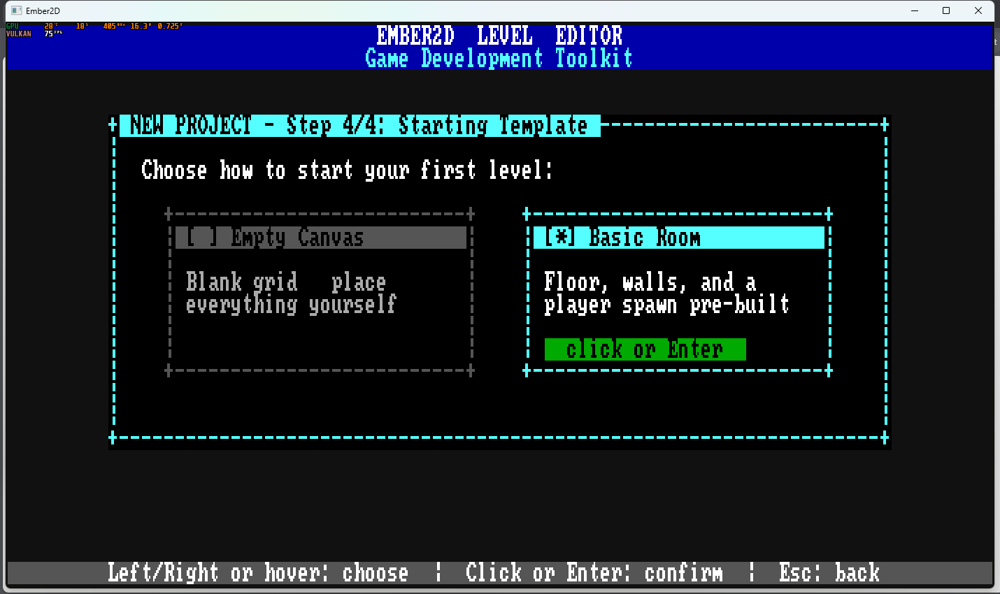
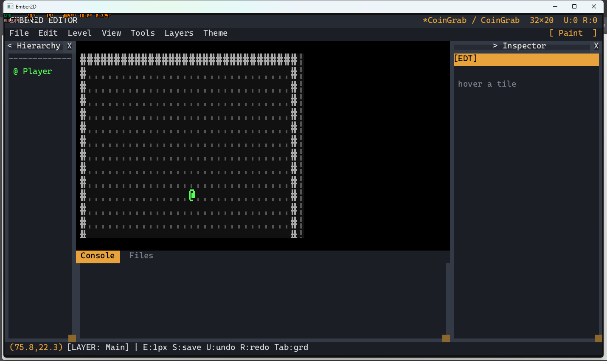
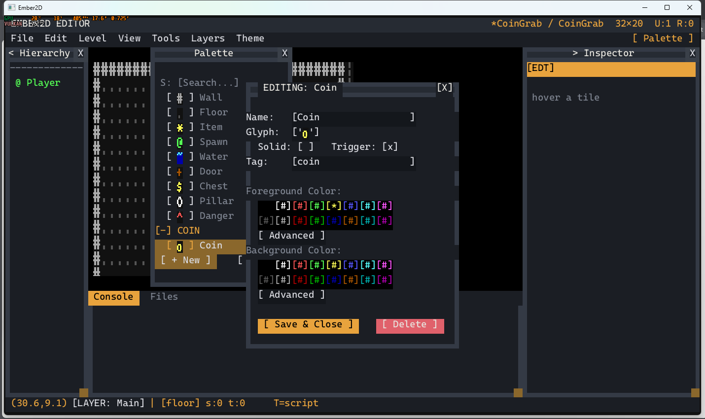
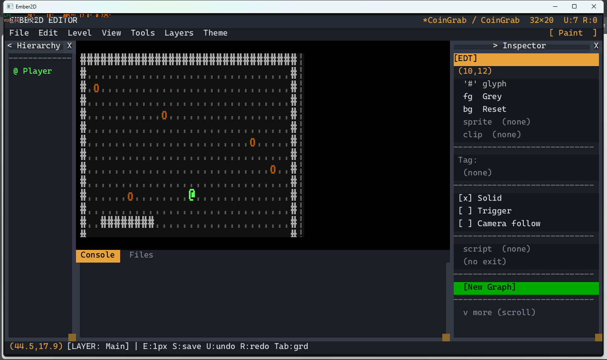
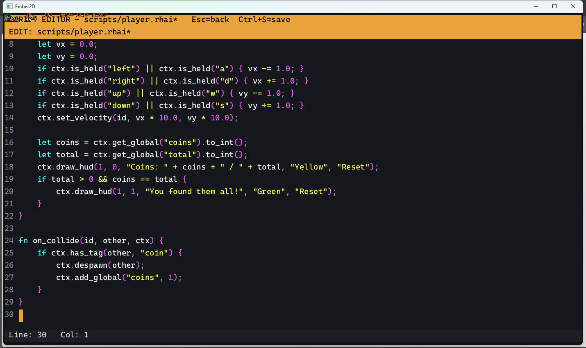
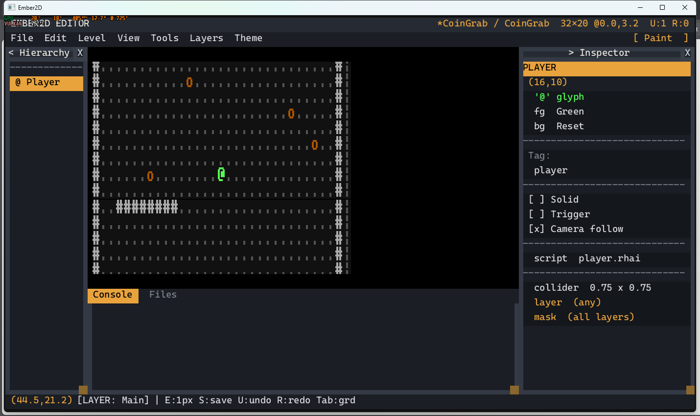
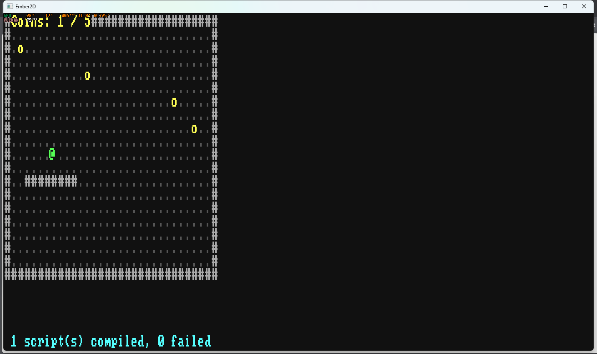
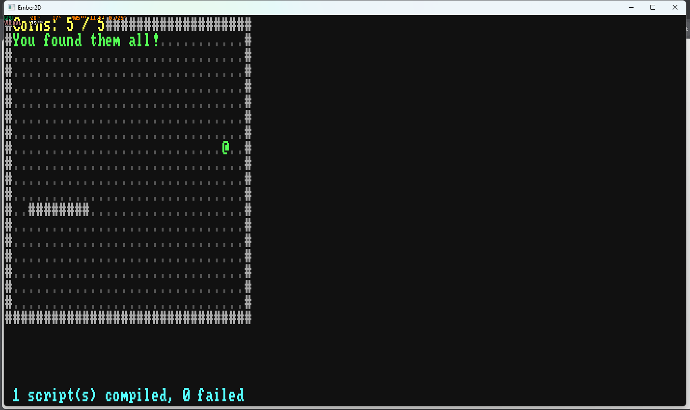
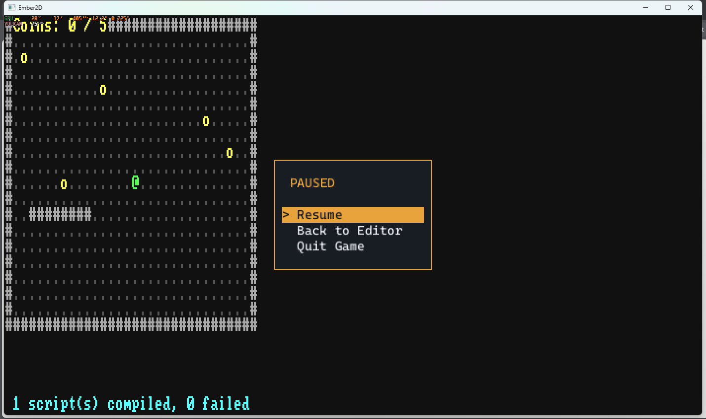

# Tutorial: your first project

You'll make **Coin Grab**: a room with five coins, and a player who walks
around and picks them up. It takes about fifteen minutes. It covers what
every later tutorial assumes:

- the New Project wizard;
- the editor's panels;
- the palette, painting and layers;
- a script, typed in the built-in script editor;
- playing, and getting back to the editor.

You need Rust installed. Run everything from the repository root.

---

## 1. A new project

Run `cargo run`. The start screen opens. Choose **New Project**, then:

1. **Name:** type `CoinGrab`, then Enter.
2. **Gameplay loop:** **Real-Time** (the world moves every frame), Enter.
3. **Location:** Enter to accept the suggested folder,
   `Projects/CoinGrab`.
4. **Template:** press Right for **Basic Room**, then Enter.



The editor opens with a walled room and the player, `@`, in the middle.
Press **S** to save. The level is `Projects/CoinGrab/main.level`.

## 2. Around the editor



- **The canvas** (middle) is the level. Scroll the mouse wheel to zoom;
  drag with the middle button to pan.
- **The menu bar** (top): File, Edit, Level, View, Tools, Layers, Theme.
- **Hierarchy** (left) lists the level's entities. There's one so far:
  the Player.
- **Inspector** (right) shows whatever is under the mouse, or what you
  selected. Hover a wall to see its glyph, colours and the **Solid** box.
- **Console** and **Files** (bottom): messages and errors, and the
  project's files.
- **The status bar** (bottom line): the mouse position in cells and the
  current layer.

A few keys to know:

| Key | Does |
|---|---|
| **S** | save the level |
| **U** / **R** | undo / redo |
| **B** | show or hide the palette |
| **1**, **2**, **3** | the Background, Main or Foreground layer |
| **F5** | play the level |

## 3. A coin in the palette

The **palette** holds the tiles you paint with. Press **B** to open it.
It already has Wall, Floor and a few others. Add a coin:

1. Click **[ + New ]**. A `New Item` entry appears at the bottom.
2. With it selected, click **[ Edit ]**.
3. Click the **Name** field, delete `New Item`, and type `Coin`.
4. Click the **Glyph** field and type `o`.
5. Tick **Trigger**. A trigger tile doesn't block movement; it reports
   when something touches it.
6. Click the **Tag** field and type `coin`. Scripts find things by tag.
7. Pick yellow in the **Foreground Color** row.



Click **[ Save & Close ]**. The palette is saved in the project
(`project.palette.ron`), so every level in it can use the entry.

## 4. Paint

With **Coin** selected in the palette, press **B** to close the palette.
Press **3** for the Foreground layer, then click five floor cells to put a
coin on each.

Layers stack: **Background** at the bottom, then **Main**, then
**Foreground** on top. The room's floor and walls are on Main. A coin on
Foreground sits over the floor, so when it's picked up the floor shows
again.

Now a wall: press **2** for Main, **4** for Wall (the numbers next to the
palette entries are keys), and drag across a few cells. Walls are
**Solid**: the player can't walk through them. Right-click erases.



Press **S**.

## 5. The player script

**File > New Script** asks for a path. Type `scripts/player.rhai`, then
Enter. The new file opens in the script editor. Type this:

```rust
// scripts/player.rhai - walk with the arrow keys (or WASD), grab every coin.
fn on_start(id, ctx) {
    ctx.set_global("coins", 0);
    ctx.set_global("total", ctx.find_all_by_tag("coin").len());
}

fn on_update(id, ctx) {
    let vx = 0.0;
    let vy = 0.0;
    if ctx.is_held("left") || ctx.is_held("a") { vx -= 1.0; }
    if ctx.is_held("right") || ctx.is_held("d") { vx += 1.0; }
    if ctx.is_held("up") || ctx.is_held("w") { vy -= 1.0; }
    if ctx.is_held("down") || ctx.is_held("s") { vy += 1.0; }
    ctx.set_velocity(id, vx * 10.0, vy * 10.0);

    let coins = ctx.get_global("coins").to_int();
    let total = ctx.get_global("total").to_int();
    ctx.draw_hud(1, 0, "Coins: " + coins + " / " + total, "Yellow", "Reset");
    if total > 0 && coins == total {
        ctx.draw_hud(1, 1, "You found them all!", "Green", "Reset");
    }
}

fn on_collide(id, other, ctx) {
    if ctx.has_tag(other, "coin") {
        ctx.despawn(other);
        ctx.add_global("coins", 1);
    }
}
```



Press **Ctrl+S** to save it, then **Escape** to go back to the level.

## 6. Attach it and play

Click **Player** in the Hierarchy. In the Inspector, click the **script**
row, type `scripts/player.rhai`, then Enter. **Camera follow** is already
ticked, so the view stays on the player in a level bigger than the
window.



Press **S**, then **F5**. Walk with the arrow keys or WASD and collect
the coins.





Press **Escape** for the pause menu. **Back to Editor** returns to the
editor; **Resume** carries on.



If the script has a mistake, the error shows in red at the bottom of the
screen and in the Console, and that script stops running. Fix it, save,
and press F5 again.

## 7. How the script works

A script is a set of functions the engine calls at the right moments.
Each gets `id` (the entity the script is attached to) and `ctx` (the
whole scripting API). A script only needs the functions it uses.

- **`on_start`** runs once, when the level starts. It sets two *globals*,
  values every script can read: the coins collected so far and how many
  coins there are. `find_all_by_tag("coin")` returns every entity tagged
  `coin`.
- **`on_update`** runs every frame (60 a second):
  - **Moving.** `set_velocity` is in cells per second, so the player
    walks at 10. The engine's physics moves the player and stops it at
    solid tiles: the script doesn't check walls itself.
  - **The HUD.** `draw_hud(x, y, text, fg, bg)` writes on the screen, not
    in the world: column 1, row 0 stays put when the camera moves. It has
    to be drawn again every frame.
- **`on_collide`** runs when the player touches something. A trigger
  tile like the coin is its own entity, so it can be despawned. (Plain
  tiles, like the floor, are packed together into one map and can't.)

Two details:

- **Writes wait.** Everything a script changes (a global, a position, a
  despawn) is applied after every script has run that frame. Reading a
  global back in the same frame gives the old value. That's why the
  pickup uses `add_global("coins", 1)` rather than
  `set_global("coins", get_global("coins") + 1)`: two coins touched in
  the same frame both count.
- **`to_int()`.** `add_global` keeps numbers with a decimal point.
  `to_int()` shows `3` rather than `3.0`.

## 8. Playing outside the editor

```
cargo run -- Projects/CoinGrab/main.level
```

runs the level directly, without the editor. **File > Project
Settings...** sets which level the project starts on (`main.level` now).
**File > Export Game...** asks for a folder and makes
`CoinGrab_Export` in it: a copy of the engine named after the game, plus
the project's levels, scripts and assets. Run that program and the game
starts, with no editor. Export from a release build
(`cargo build --release`) for a game that runs at full speed.

---

## Where to go next

- **[Ember Assault](shooter.md):** a real-time arena shooter. Spawning
  from scripts, collision layers, waves, a boss, sound, a stress test.
- **[Depths of Ember](roguelike.md):** a turn-based roguelike. Levels
  generated by a script, fog of war, monsters taking turns, items.
- **[Emberfall](rpg.md):** a small RPG with sprites. Tilesets, animation
  clips, scenes, dialogue and menus, battles, saving.
- `docs/ember2d-scripting-api.md` lists every function `ctx` has.
