# Tutorial: Depths of Ember, a 20-floor roguelike

You'll build **Depths of Ember**, a classic turn-based dungeon crawl in the
spirit of the libtcod
[Roguelike Tutorial](https://rogueliketutorials.com/). It has:

- twenty floors, each generated from rooms and corridors;
- fog of war, and monsters that wake when they see you;
- melee with power and defense, and a message log;
- potions, three magic scrolls (one aimed with a cursor), and weapons and
  armour to find;
- experience and level-ups;
- the Amulet of Ember on the last floor, guarded by a drake, which you must
  carry back up;
- a title screen, save and quit, Continue, and permadeath.

It's all ASCII, and none of it is a level painted by hand: one script
builds every floor when the level loads.

The finished game ships in `demos/roguelike/`:

```
cargo run -- demos/roguelike/title.level
```

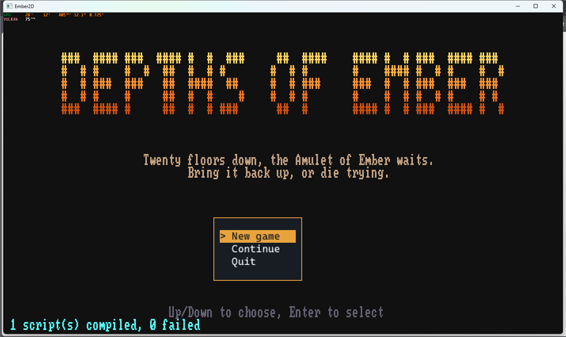

This tutorial builds it in stages. The first two (a floor you can walk
around, with fog of war) are typed in full. Later stages show the key
code and point to the finished scripts, which are commented throughout:

| File | What it does |
|---|---|
| `scripts/dungeon.rhai` | builds each floor, places monsters and items, draws the HUD |
| `scripts/player.rhai` | the controls, combat, items, aiming, levelling, stairs |
| `scripts/monster.rhai` | every monster's turn |
| `scripts/title.rhai` | the title screen |
| `scenes/pause.rhai` | the Escape menu: save and quit |

---

## 1. A turn-based project

`cargo run`, then **New Project**:

1. **Name:** type it, then Enter.
2. **Visual style:** **Classic ASCII**, Enter.
3. **Gameplay loop:** press Right for **Turn-Based**, then Enter.
4. **Location:** confirm.
5. **Template:** **Empty Canvas**.

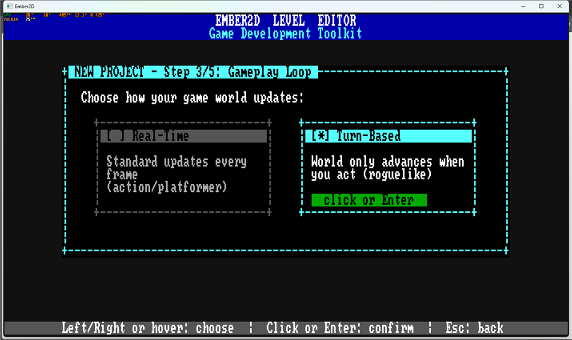

In a turn-based project, the world only moves when the player acts. Each
script can have an `on_turn` that runs when its turn comes round.

**File > Project Settings...** shows two settings that matter here:

- **AI turns/step** is 256 for a new turn-based project. It lets every
  monster answer your move in the same frame. With 1, forty monsters would
  take forty frames, about two-thirds of a second, after every step.
- **Turn order:** pick **Energy**, so fast monsters (speed 150) act more
  often than slow ones (speed 80).

## 2. The dungeon level

Press **S** to save `main.level`. In the finished game it's called
`dungeon.level`; any name works.

1. **Level > Resize Level**, type `80x43`. That's the size of a floor:
   80 columns by 43 rows.
2. Put **one tile** in the top-left corner with the Paint tool. Any
   palette entry will do; it'll be under a wall anyway.
3. Choose **Tools > Select** (**Q**) and click that tile. In the
   Inspector, set its **script** to `scripts/dungeon.rhai`.

This one tile carries the script that builds the whole floor.

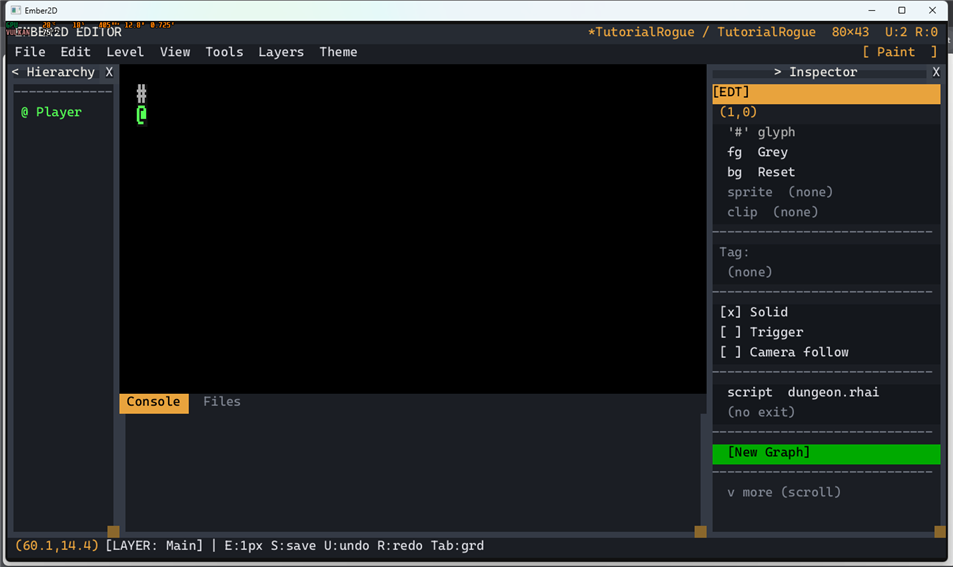

## 3. Carving a floor

**File > New Script**, `scripts/dungeon.rhai`. Type:

```rust
// scripts/dungeon.rhai - carve a floor of rooms and corridors.
fn on_start(id, ctx) {
    ctx.tile_def("wall", #{ glyph: "#", fg: "#8a8a9a", bg: "#20202a", solid: true });
    ctx.tile_def("floor", #{ glyph: ".", fg: "#68708a" });
    ctx.tilemap_resize(80, 43);
    ctx.tile_fill(0, 0, 80, 43, "wall");
    let rooms = [];
    for attempt in 0..30 {
        let w = ctx.random_int(6, 10);
        let h = ctx.random_int(6, 10);
        let x = ctx.random_int(0, 80 - w - 1);
        let y = ctx.random_int(0, 43 - h - 1);
        let room = [x, y, w, h];
        let clear = true;
        for other in rooms {
            if overlaps(room, other) { clear = false; }
        }
        if !clear { continue; }
        ctx.tile_fill(x + 1, y + 1, w - 1, h - 1, "floor");
        if rooms.len() > 0 { tunnel(ctx, centre(rooms[rooms.len() - 1]), centre(room)); }
        rooms.push(room);
    }
    let start = centre(rooms[0]);
    ctx.set_position(ctx.find_by_tag("player"), start[0], start[1]);
    ctx.compute_fov(start[0], start[1], 8);
}

fn overlaps(a, b) {
    a[0] <= b[0] + b[2] && a[0] + a[2] >= b[0] && a[1] <= b[1] + b[3] && a[1] + a[3] >= b[1]
}

fn centre(r) { [r[0] + r[2] / 2, r[1] + r[3] / 2] }

fn tunnel(ctx, a, b) {
    let x1 = a[0];
    let y1 = a[1];
    let x2 = b[0];
    let y2 = b[1];
    let lo_x = if x1 < x2 { x1 } else { x2 };
    let lo_y = if y1 < y2 { y1 } else { y2 };
    ctx.tile_fill(lo_x, y1, (x2 - x1).abs() + 1, 1, "floor");
    ctx.tile_fill(x2, lo_y, 1, (y2 - y1).abs() + 1, "floor");
}
```

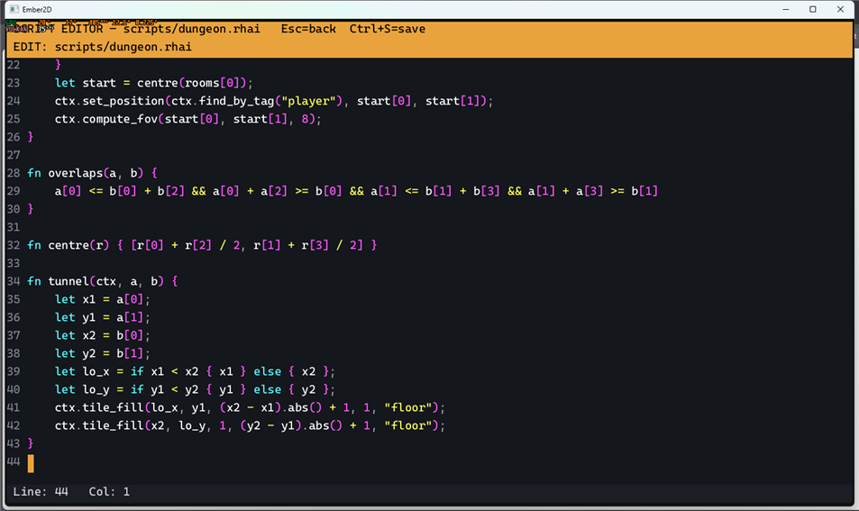

This is the algorithm from part 3 of the libtcod tutorial:

1. Fill the map with wall.
2. Drop up to 30 rooms of random size at random places, and throw away
   any that overlap one already placed.
3. Join each new room to the previous one with an L-shaped corridor. That
   makes every room reachable.

**Tiles, not entities.** `tile_def` names a kind of tile once.
`tile_fill`/`tile_set` then stamp it into the level's *tilemap*. That's
the same grid a painted level's walls live in: one entity for the whole
floor, however many cells. Spawning an entity per wall would make 3,440
entities.

Changes are applied after the script finishes. This step's collision
sees them, but the script's own reads (`is_solid_at`, `get_tile`) only
see them from the next step.

`compute_fov(x, y, radius)` turns on **fog of war**:

- play mode draws only what's been seen;
- cells seen before but out of view are dimmed;
- monsters out of view are hidden.

Walls block sight. Call it again whenever the viewer moves.

## 4. Walking, one turn at a time

**File > New Script**, `scripts/player.rhai`:

```rust
// scripts/player.rhai - one step per key, the world waits in between.
fn on_input(id, ctx) {
    let dx = 0;
    let dy = 0;
    if ctx.just_pressed("up") { dy = -1; }
    else if ctx.just_pressed("down") { dy = 1; }
    else if ctx.just_pressed("left") { dx = -1; }
    else if ctx.just_pressed("right") { dx = 1; }
    if dx != 0 || dy != 0 { ctx.submit(id, "move", [dx * 1.0, dy * 1.0]); }
}

fn on_turn(id, ctx) {
    if ctx.command_action() != "move" { return; }
    let tx = ctx.get_x(id) + ctx.command_param(0);
    let ty = ctx.get_y(id) + ctx.command_param(1);
    if ctx.is_solid_at(tx, ty) { return; }
    ctx.set_position(id, tx, ty);
    ctx.compute_fov(tx, ty, 8);
    ctx.act(100.0);
}
```

Click **Player** in the Hierarchy and set its **script** to
`scripts/player.rhai`. Make sure **Camera follow** is ticked. Save, press
**F5**, and walk around. A new room appears as you reach it.

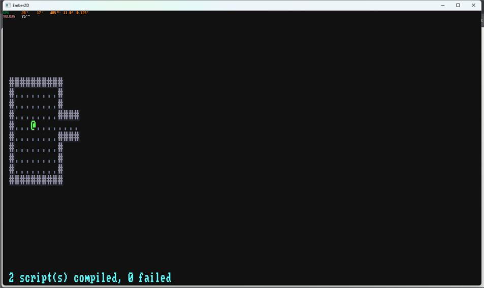

**The turn rule.** Turn-based input comes in two halves:

- `on_input` reads keys and *submits* a command;
- `on_turn` runs when the scheduler gives the player its turn, and carries
  the command out.

Calling `act(100)` spends the turn. Returning without it (bumping a wall)
spends nothing, and the player is simply asked again. Because only
commands change the world, a recorded game replays exactly.

## 5. Monsters

A monster is a spawned entity with:

- its stats in vars;
- its own script;
- `make_actor`, so it takes turns.

`spawn_monster` in `dungeon.rhai`:

```rust
let m = ctx.spawn_entity(s[0], x * 1.0, y * 1.0, "monster");
ctx.set_tint(m, s[1], "Reset");
ctx.set_var(m, "name", s[7]);
ctx.set_var(m, "hp", s[2]);
ctx.set_var(m, "power", s[3]);
ctx.set_var(m, "defense", s[4]);
ctx.set_var(m, "xp", s[5]);
ctx.set_script(m, "scripts/monster.rhai");
ctx.make_actor(m, s[6]);   // speed
```

What lives on each floor comes from tables:

- `monster_table` holds `[name, weight, from depth, to depth]` rows: rats
  and kobolds near the top, then orcs, trolls, ogres, wraiths, and dragon
  whelps at the bottom;
- `pick` makes a weighted choice among the rows that fit the depth;
- `monster_stats` gives each one's glyph, colour, HP, power, defense, XP
  and speed.

`scripts/monster.rhai` is each monster's `on_turn`:

1. **Wake.** It sleeps until the player can see it. Sight is symmetric,
   so "it sees you" is just `is_in_fov(its x, its y)`.
2. **Act.** Once awake, it walks the shortest path toward you
   (`get_path`) and attacks when it's next to you.
3. **Confused** (by a scroll), it stumbles at random instead.

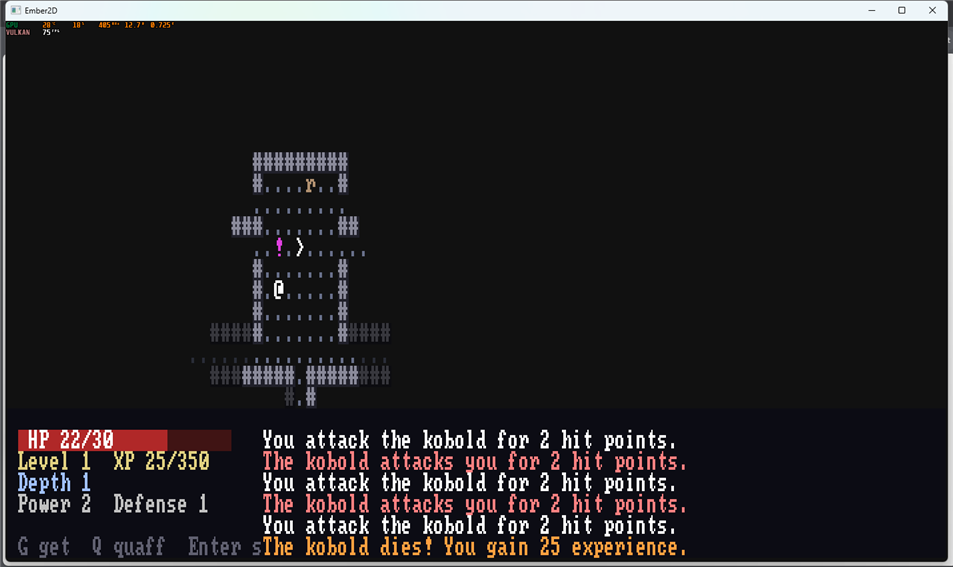

## 6. Combat and the message log

Moving into a monster attacks it. Damage is the attacker's power minus
the defender's defense. A kill leaves a corpse (`%`) and pays experience.

Everything that happens is written to a log kept in persistent state:
an array of `[text, colour]` pairs.

```rust
fn say(ctx, msgs) {
    if msgs.len() == 0 { return; }
    let log = if ctx.has_persistent("log") { ctx.get_persistent("log") } else { [] };
    for m in msgs { log.push(m); }
    while log.len() > 60 { log.remove(0); }
    ctx.set_persistent("log", log);
}
```

**Two Rhai lessons are hiding in here.**

1. **Writes are deferred.** A second `say` in the same turn would read
   the log as it was before the first one, and lose a line. So a function
   that has something to say *returns* its lines, and the turn writes them
   once.
2. **Rhai passes arrays and maps by value.** A function can't push into
   its caller's array; it returns a new one instead. When you do need
   to change a value in place, call the function method-style:
   `taken.free_spot(ctx, room)` binds `this` to `taken` by reference.

## 7. The HUD

`dungeon.rhai`'s `on_update` draws the bottom panel every frame, all from
persistent state:

- an HP bar (two `fill_rect`s);
- level, XP, depth, power, defense and gear;
- the newest messages, word-wrapped with `wrap_text`, each in its colour.

**Mouse-look** reads `get_mouse_world_x/y`. If that cell is in view, it
lists the names of what's there.

The camera is allowed eight rows past the map, so the panel never hides
the bottom of a floor:

```rust
ctx.set_camera_bounds(0, 0, 80, 51);
```

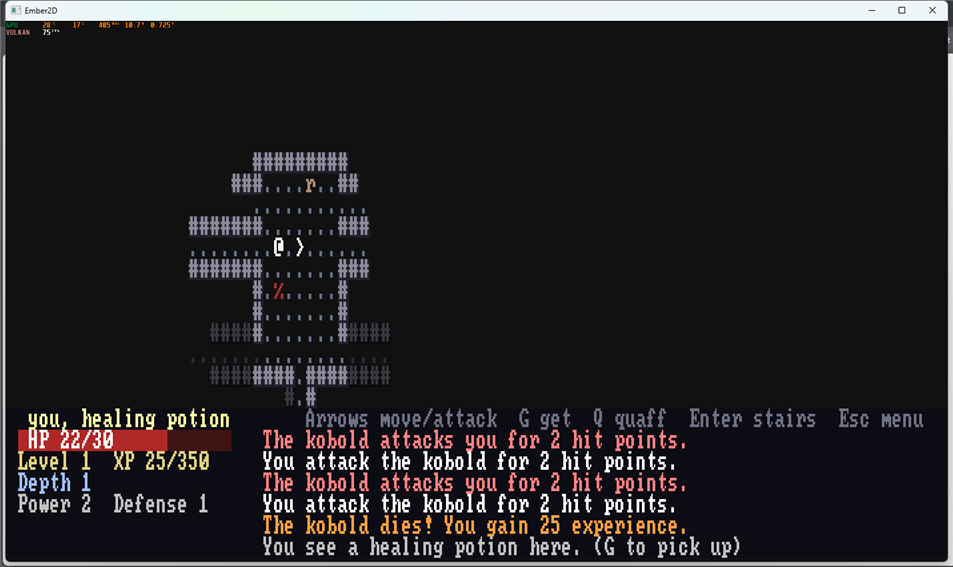

## 8. Items and the pack

Items are spawned entities too, tagged `item`, with a `kind` and a
`name`.

- **G** picks the one underfoot into the pack (persistent `inventory`).
- **I** opens the pack as a menu (`menu_open`).
- **X** drops something.

Menus are opened and read in `on_input`, while the game waits:

```rust
fn menu_input(id, ctx) {
    let m = ctx.get_var(id, "menu");
    if !ctx.menu_closed(m) { return; }
    let pick = ctx.menu_selection(m);
    ...
    ctx.submit(id, "use", [pick * 1.0]);
}
```

Only the final choice becomes a command, so using an item is a turn like
any other. `item_info` says what each kind does:

- healing potions heal;
- the lightning scroll strikes the nearest monster in view;
- equipment goes in the `weapon` or `armour` slot, and the old piece goes
  back into the pack.

Watch out for keys Rhai reserves. The field is called `effect`, not
`use`: `use` is reserved, even as a map key.

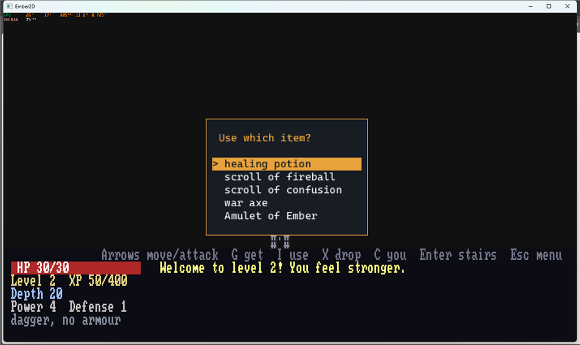

## 9. Aiming

The confusion and fireball scrolls need a target. Choosing one spawns a
**cursor** entity on the player:

- the arrows move it;
- Enter or a mouse click casts;
- Backspace or a right-click cancels.

Escape stays the pause menu: when no menu is open, the engine gives it to
the pause scene.

```rust
ctx.submit(id, "cast", [aim.slot * 1.0, tx, ty]);
```

The target cell travels *in the command*. Even a mouse-aimed fireball
replays exactly. Mouse world coordinates aren't replay-safe on their own,
but the command records the cell that was chosen.

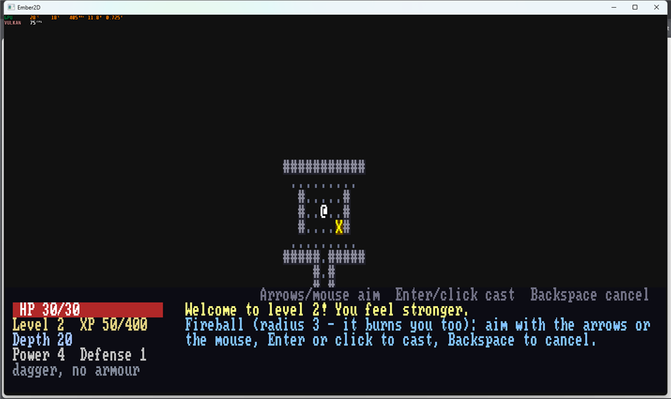

## 10. Experience and levels

Each kill adds its XP. When it reaches `100 + 150 × level`, `on_input`
opens a menu that can't be cancelled: Toughness (+20 max HP), Strength
(+1 power) or Agility (+1 defense). Choosing costs no turn.

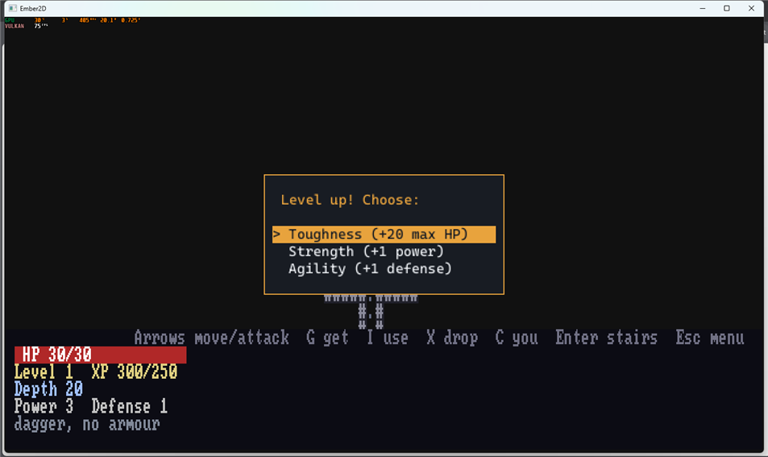

## 11. Going deeper

The stairs `>` are an entity in the last room. Enter on them adds one to
the depth (persistent) and reloads the same level:

```rust
ctx.set_persistent("depth", ctx.get_persistent("depth") + 1);
ctx.load_level("dungeon.level");
```

The generator reseeds before it rolls anything:

```rust
ctx.set_random_seed(seed * 1000 + depth);
```

So a floor depends only on the run's seed and its depth. Floor 10 of a
run is the same however you got there, and a test can check floors 1, 10
and 20 of a seed directly (`ember2d/tests/roguelike_dungeon.rs`).

The run's seed comes from the title screen: it counts frames until you
choose New game. That makes it different every time, yet a replay
reproduces it.

## 12. Title, saving and death

- **The title** (`title.level` + `scripts/title.rhai`) draws a banner and
  a menu.
  - New game resets persistent state (`clear_all_persistent`), seeds the
    run, then calls `load_level("dungeon.level")`.
  - Continue calls `load_game("depths.sav")`.
- **The pause menu** (`scenes/pause.rhai`) replaces the engine's
  built-in one. Save and quit closes the menu *before* saving, so the
  save doesn't include it, then goes to the title.
- **Death** shows a death screen. Enter returns to the title. The monster
  that kills you also saves the game at that moment, so Continue can't
  take it back: permadeath.

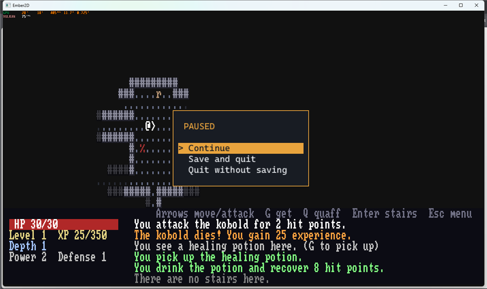
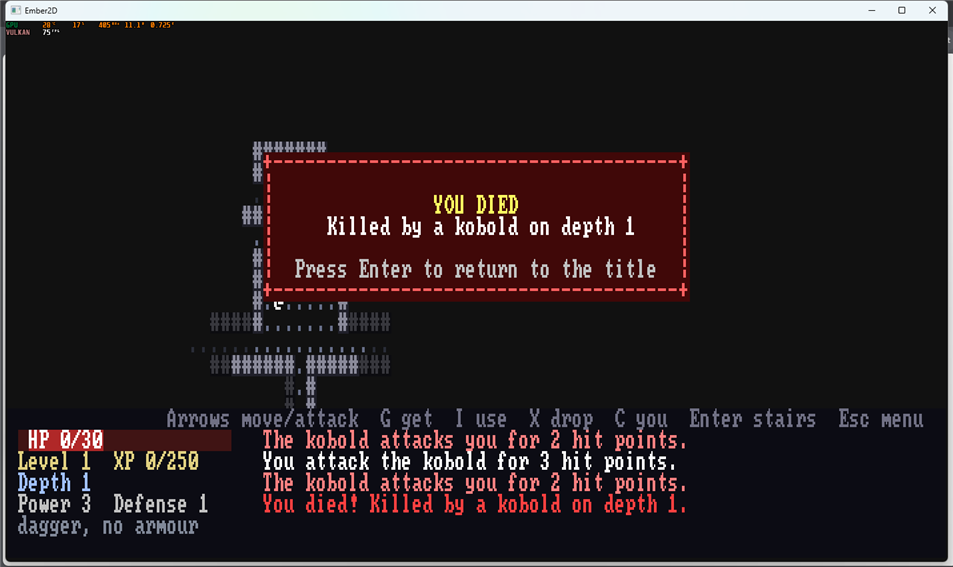

## 13. Winning

Floor 20 has no stairs down. It has:

- the Amulet of Ember in the last room;
- the Ember Drake next to it: 140 HP, power 18;
- stairs up where you arrive.

Carry the Amulet back to those stairs and press Enter to win.

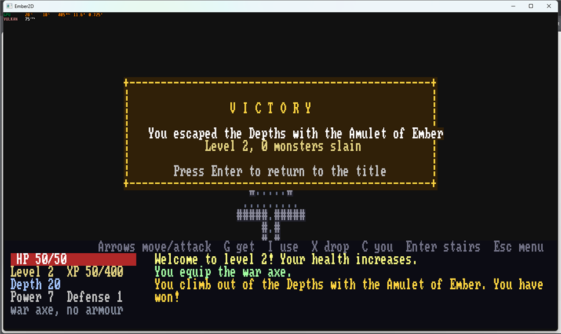

---

## Where to go next

- `docs/ember2d-scripting-api.md` covers the functions this game leans on:
  "Tiles", "Field of view", "The command boundary" (turns, `make_actor`,
  `ai_turns_per_step`), "Randomness" (`set_random_seed`) and "Menus and
  dialogue".
- `ember2d/tests/roguelike_dungeon.rs` and `roguelike_items.rs` play the
  game with real key presses. One test sends a bot down ten floors and
  fails on any script warning. The ignored `honest_bot_depths` prints how
  deep an honest bot gets: a quick way to check balance after changing
  the tables.
