# Tutorial: Emberfall, a small sprite RPG

You'll build **Emberfall**, a short top-down RPG made from sprite tiles,
using only the Ember2D editor and its scripting language (Rhai). It
covers:

- a title screen, with New Game and Continue;
- a town with people who talk, a branching choice, a shop and an inn;
- a field where walking through tall grass starts random battles;
- a turn-based battle screen;
- a pause menu that saves the game;
- a boss that stays beaten.

The finished game ships with the engine in `demos/rpg/`. Play it first to
see where you're heading:

```
cargo run -- demos/rpg/title.level
```

Everything in it was made the way this tutorial makes it. Its levels are
checked by a test (`ember2d-editor/tests/editor_demo_levels.rs`) to be
exactly what the editor saves, so you can open any of them in the editor
(`cargo run -- --editor demos/rpg/town.level`) and compare as you go.

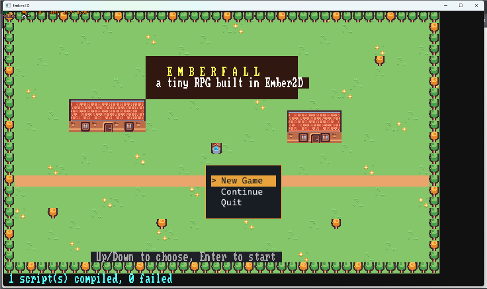

**What you need:**

- Ember2D, built (`cargo build`).
- Two free sprite packs by Kenney, both public domain (CC0):
  [Tiny Town](https://kenney.nl/assets/tiny-town) and
  [Tiny Dungeon](https://kenney.nl/assets/tiny-dungeon). From each zip you
  only need `Tilemap/tilemap_packed.png`.
- A few extra sprites the packs don't have: walking frames for the hero
  and the mage, slash effects, a battle backdrop. Copy
  `demos/rpg/assets/tilesets/extras.png` (CC0, made for the demo), or draw
  your own: one row of 16x16 cells.

Paths below are relative to your project folder.

---

## 1. A sprite project

Run `cargo run` to reach the start screen. Choose **New Project**, then:

1. **Name:** type `Emberfall`, then Enter.
2. **Gameplay loop:** **Real-Time**.
3. **Location:** confirm the suggested folder.
4. **Template:** **Empty Canvas**.

The editor opens an empty `main.level`. Press **S** to save it.

A new project uses tall 8x16-pixel world cells, the shape of a text glyph.
The Kenney tiles are 16x16, so make the cells square. Open **File > Project
Settings...** and set two rows (click a row, replace its value, Enter):

- **World cell (px):** `16x16`.
- **Pixels per unit:** `16`, so one 16-pixel tile fills one cell.

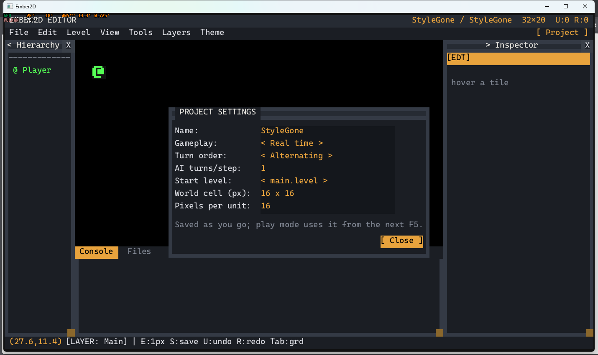

Glyphs and sprites can share a level either way; the cell only decides
the shape of the grid. The same dialog sets the start level and more.

Then copy the three sprite sheets into the project folder: name the two
Kenney sheets `tiny_town.png` and `tiny_dungeon.png`, plus `extras.png`.

## 2. Import the tilesets

**File > Import Tileset...** asks for an image. Pick `tiny_town.png`. The
importer slices it into a 16x16 grid. Change **Name** to `town`, then name
the cells you'll use: click a cell, then type its name. A cell only becomes
a usable region once it has a name. The demo names these cells
(column, row):

| Region | Cell | Region | Cell | Region | Cell |
|---|---|---|---|---|---|
| grass | 0,0 | roof_tl | 4,4 | fence_l | 8,6 |
| grass_b | 1,0 | roof_t | 5,4 | fence | 9,6 |
| flowers | 2,0 | roof_tr | 6,4 | fence_r | 10,6 |
| tree_autumn | 3,1 | roof_bl | 4,5 | sign | 11,6 |
| tree | 4,1 | roof_b | 5,5 | well | 8,8 |
| bush | 5,0 | roof_br | 6,5 | barrel | 10,8 |
| sprout | 5,1 | wall | 1,6 | pot | 11,8 |
| mushrooms | 5,2 | window | 0,7 | beehive | 10,7 |
| dirt | 1,2 | door | 2,7 | coin | 9,7 |
| plaza | 7,3 | floor_stone | 1,9 | | |

Click **[ Import ]** (or press Enter). The sheet is copied to
`assets/tilesets/town.png`, its slicing saved beside it as `town.ron`, and
every named region gets an entry in the palette.

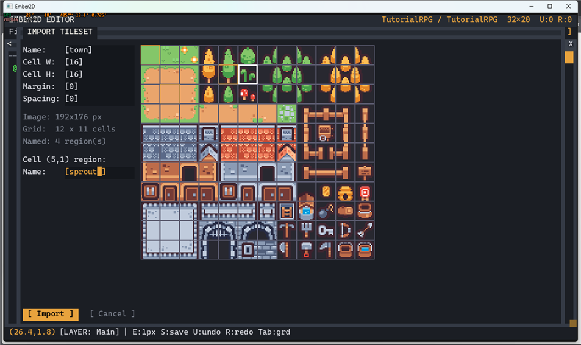

Import the other two sheets the same way:

- **`dungeon`** (`tiny_dungeon.png`): sand 0,4 · brick 1,3 · torch 5,2 ·
  table 0,6 · shelf 3,6 · barrel 6,5 · chest 5,7 · hero 4,7 · mage 0,7 ·
  elder 3,9 · shopkeeper 2,7 · innkeeper 3,8 · slime 0,9 · cyclops 1,9 ·
  bat 0,10 · ghost 1,10 · spider 2,10 · potion 7,9.
- **`extras`**: hero, hero_step, mage, mage_step, slash_a, slash_b, heart,
  cursor, shadow, sparkle, battle_bg, in that order along the row.

If you forget a region, import the same sheet again. The importer keeps
the names you already gave.

## 3. Paint the town

Open the palette with **B** (or **View > Palette**). Pick a region's entry,
then a tool from the **Tools** menu:

- **Paint:** click or drag.
- **Rect:** drag a rectangle.
- **Line:** click the start, then click the end. Pressing **L** also
  starts a line at the mouse.
- **Fill:** click; it fills the area of matching tiles.

Right-click erases.

There are three layers (the **Layers** menu, or keys 1-3):

- **Background:** ground (grass, dirt, plaza, flowers).
- **Main:** things that stand on the ground (trees, houses, fences, the
  well, people).
- **Foreground:** drawn over everything, including the hero.

To make something block movement, select its palette entry, click
**[ Edit ]** and tick **Solid**. The demo makes the trees, roofs, walls,
windows, fences, the well, barrels and bushes solid. Paths, grass and the
house doors stay walkable.

Make the level bigger with **Level > Resize Level** (the demo's town is
48x30). Then lay out a town:

- fill it with `grass`, sprinkle in `grass_b` and `flowers`;
- run a `dirt` road east-west across the middle;
- put a `plaza` square with the `well` on it;
- border the map with `tree` and `tree_autumn`, leaving a gap on the east
  edge for the road out;
- build three houses: a roof row (`roof_tl`, `roof_t`..., `roof_tr`), a
  lower roof row (`roof_bl`, `roof_b`..., `roof_br`), and a wall row of
  `wall`/`window` with a `door` in it.

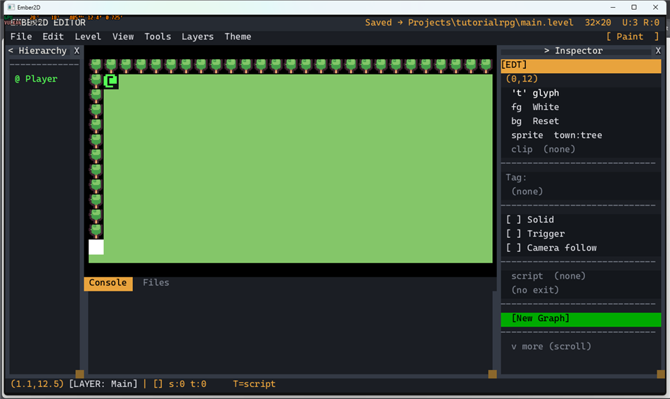

Press **S** to save often. Press **F5** (or **File > Play**) to play the
level, and **Escape** to come back.

## 4. The hero walks

**File > New Script**, type `scripts/player.rhai`, then Enter. The file
opens in the built-in script editor (the Scripter). Type:

```rust
// scripts/player.rhai - walk one tile at a time with the arrow keys.
fn on_start(id, ctx) {
    ctx.set_var(id, "wait", 0.0);
}

fn on_update(id, ctx) {
    let wait = ctx.get_var(id, "wait") - ctx.get_delta();
    ctx.set_var(id, "wait", wait);
    if wait > 0.0 { return; }
    let dx = 0;
    let dy = 0;
    if ctx.is_held("left") { dx = -1; }
    else if ctx.is_held("right") { dx = 1; }
    else if ctx.is_held("up") { dy = -1; }
    else if ctx.is_held("down") { dy = 1; }
    if dx == 0 && dy == 0 { return; }
    let nx = ctx.get_x(id) + dx;
    let ny = ctx.get_y(id) + dy;
    if ctx.is_solid_at(nx, ny) { return; }
    ctx.set_position(id, nx, ny);
    ctx.set_var(id, "wait", 0.14);
}
```

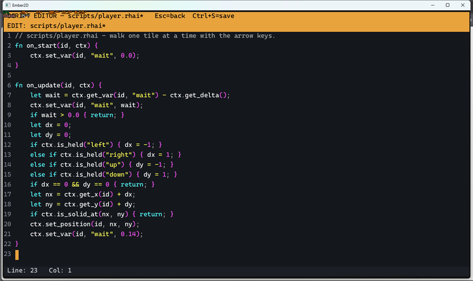

Press **Ctrl+S** to save it, then Escape to return to the level.

`on_start` runs once; `on_update` runs every frame (60 a second). The hero
waits 0.14 seconds between steps, and won't step onto a solid tile.
`set_var`/`get_var` keep values between frames, one set per entity.

Now attach the script to the hero. Click **Player** in the Hierarchy
panel, then the **script** row in the Inspector, and type
`scripts/player.rhai`. While you're there:

- tick **Camera follow**, so the view scrolls with the hero;
- set the **collider** to `0.8,0.8`;
- move the start point with **Level > Set Spawn** (then click a tile).

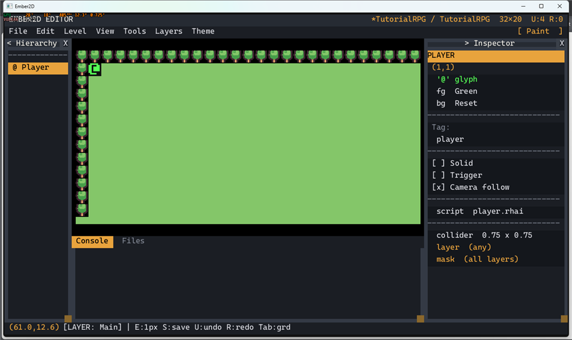

Press F5 and walk around.

**Make it a sprite.** The hero is still drawn as an `@` glyph. Open
**File > Animation Clips...** and make a clip named `hero_walk` from the
`extras` tileset: click `hero`, then `hero_step` to add them as frames,
set **FPS** to 8, and leave looping on. Make `mage_idle` too (`mage`,
`mage_step`, 3 FPS), and `slash` (`slash_a`, `slash_b`, `sparkle`, 10 FPS,
looping off) for the battles. Clips are saved under `assets/clips/`.

Then add to `on_start`:

```rust
    ctx.play_project_clip(id, "hero_walk");
    ctx.set_layer_order(id, 10);   // the same draw layer as trees and people...
    ctx.set_y_sort(true);          // ...so whoever is lower on screen is in front
```

To face the way the hero walks, add this after the line with `dx == 0`.
It mirrors the sprite when walking left:

```rust
    if dx != 0 { ctx.set_flip(id, dx < 0, false); }
```

The finished `demos/rpg/scripts/player.rhai` also remembers which way the
hero faces (`fx`, `fy`). It turns the hero even when the way is blocked,
so you can face someone across a counter.

## 5. People who talk

Paint the townsfolk from the `dungeon` palette entries on the **Main**
layer: an `elder` by the well, a `shopkeeper` between two barrels, and a
`sign` by the crossroads (from `town`). For each one, choose **Tools >
Select** (or press **Q**), click the tile, and in the Inspector:

- tick **Solid**;
- set **Tag** to who it is: `elder`, `shop` or `sign`;
- set **script** to `scripts/npc.rhai`.

One script serves everyone: it reads the tile's tag to know who it is.
Rhai scripts can't import each other here, so shared code lives in one
file.

**Starting a conversation (player side).** When Space is pressed, look at
the tile the hero faces. If it's someone you can talk to, tell everyone
through two *globals* (values every script can see). Add this near the
top of `on_update`, before the walking code:

```rust
    // Someone is talking (an NPC script sets this): stand still.
    if ctx.has_global("talking") { return; }

    if ctx.just_pressed("space") || ctx.just_pressed("enter") {
        let e = ctx.get_entity_at(ctx.get_x(id) + ctx.get_var(id, "fx"),
                                  ctx.get_y(id) + ctx.get_var(id, "fy"));
        if e >= 0 && !ctx.is_tilemap(e)
            && ["elder", "shop", "inn", "sign", "boss"].contains(ctx.get_tag(e)) {
            ctx.set_global("talk", e);
            ctx.set_global("talking", true);
            return;
        }
    }
```

(Set `fx`/`fy` to the last direction walked, as the finished script does.)

**The other side.** Create `scripts/npc.rhai`. Each character checks
whether it's the one being talked to, then steps through its lines. One
`step` is one dialogue box or one menu:

```rust
fn on_update(id, ctx) {
    if !ctx.has_global("talk") || ctx.get_global("talk") != id { return; }
    let tag = ctx.get_tag(id);
    if tag == "elder" { elder(id, ctx); }
    else if tag == "shop" { shop(id, ctx); }
    else { sign(id, ctx); }
}

fn step(id, ctx) {
    if ctx.has_var(id, "step") { ctx.get_var(id, "step") } else { 0 }
}

/// Shows `text` (once) and returns true once it has been read.
fn said(id, ctx, text, who) {
    if !ctx.has_var(id, "dlg") {
        ctx.set_var(id, "dlg", ctx.draw_dialogue(text, who));
        return false;
    }
    if ctx.dialogue_done(ctx.get_var(id, "dlg")) {
        ctx.remove_var(id, "dlg");
        return true;
    }
    false
}

fn next(id, ctx, n) { ctx.set_var(id, "step", n); }

fn done(id, ctx) {
    ctx.remove_var(id, "step");
    ctx.remove_global("talk");
    ctx.remove_global("talking");
}

fn sign(id, ctx) {
    if said(id, ctx, "EMBERFALL. East road: the Wild Fields.", "Sign") {
        done(id, ctx);
    }
}
```

`draw_dialogue` opens a box at the bottom of the screen. A long text pages
itself; Enter turns the page and closes the box. The script keeps the
box's handle in a var and asks `dialogue_done` each frame.

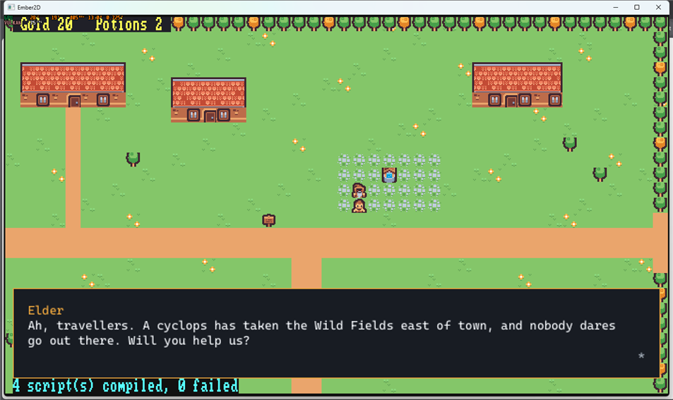

## 6. A choice, and things to remember

The elder asks for help. A **menu** asks the question:

```rust
/// Opens `items` (once) and returns the choice once made: -1 while still
/// open, -2 if cancelled with Escape.
fn chose(id, ctx, items, title) {
    if !ctx.has_var(id, "menu") {
        ctx.set_var(id, "menu", ctx.menu_open(items, #{ title: title }));
        return -1;
    }
    let m = ctx.get_var(id, "menu");
    if !ctx.menu_closed(m) { return -1; }
    let sel = ctx.menu_selection(m);
    ctx.menu_close(m);
    ctx.remove_var(id, "menu");
    if sel < 0 { -2 } else { sel }
}

fn elder(id, ctx) {
    let s = step(id, ctx);
    if s == 0 && said(id, ctx, "A cyclops has taken the Wild Fields. Will you help us?", "Elder") { next(id, ctx, 1); }
    if s == 1 {
        let c = chose(id, ctx, ["Yes, we'll go", "Not right now"], "Help the elder?");
        if c == 0 {
            ctx.set_persistent("quest", "accepted");
            ctx.set_persistent("potions", ctx.get_persistent("potions") + 2);
            next(id, ctx, 2);
        } else if c == 1 || c == -2 {
            next(id, ctx, 3);
        }
    }
    if s == 2 && said(id, ctx, "Bless you! Take these two potions.", "Elder") { done(id, ctx); }
    if s == 3 && said(id, ctx, "Come back if you change your mind.", "Elder") { done(id, ctx); }
}
```

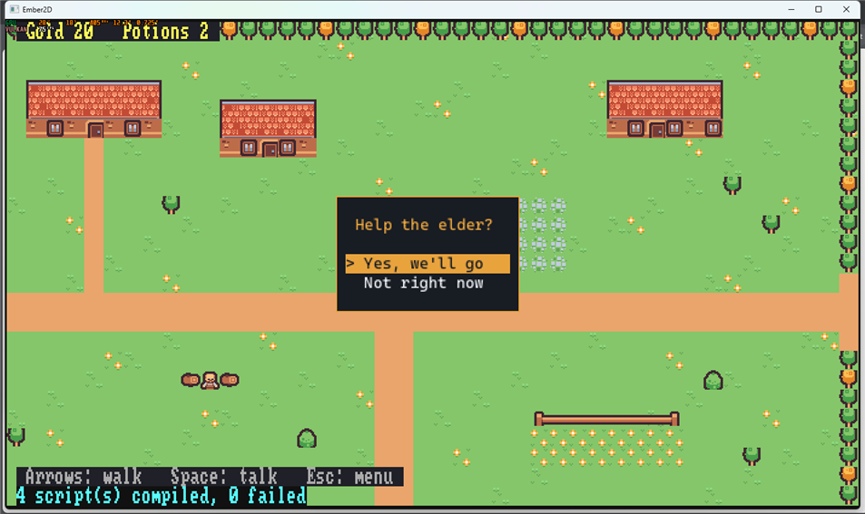

**Persistent state** (`set_persistent`/`get_persistent`) is how the game
remembers things. It survives moving between levels and goes into save
files. The demo keeps everything there:

- the party: a list of maps with `name`, `hp`, `max`, `atk`, `def`, `mag`;
- `gold` and `potions`;
- the `quest`, and `boss_done`.

Set it up once, in the player's `on_start`, unless a title screen already
did:

```rust
    if !ctx.has_persistent("party") {
        ctx.set_persistent("party", [
            #{ name: "Ash", hp: 24, max: 24, atk: 5, def: 1, mag: 0 },
            #{ name: "Lyra", hp: 16, max: 16, atk: 2, def: 0, mag: 6 },
        ]);
        ctx.set_persistent("gold", 20);
        ctx.set_persistent("potions", 2);
        ctx.set_persistent("quest", "");
        ctx.set_persistent("boss_done", false);
    }
```

Draw a status line in the player's `on_update`. HUD text sits on the
screen's text grid (80x24 glyph cells), not on the world:

```rust
    ctx.draw_hud(1, 0, " Gold " + ctx.get_persistent("gold") + "   Potions "
        + ctx.get_persistent("potions") + " ", "Yellow", "#202028");
```

The shop is the same pattern: a menu `["Buy a potion (10 gold)", "Leave"]`
that takes gold and adds a potion. See `shop` in
`demos/rpg/scripts/npc.rhai`.

A Rhai tip: functions in a script can't see the script's top-level
`let`/`const` values. For a tuning number, write a tiny function instead,
such as `fn step_time() { 0.14 }`.

## 7. Going inside: exits and spawn points

The inn is its own level. **File > New Level** saves the current level,
then asks for a name: type `inn`, and it creates `inn.level` beside
`town.level`. Resize it with **Level > Resize Level** (`40x24`). A level smaller than the window stays
pinned to the top-left, so the demo makes the inn 40x24 and paints the
room in the middle. Paint:

- a `floor_stone` floor;
- `brick` walls with a gap at the bottom;
- tables, shelves and torches;
- the `innkeeper` (tag `inn`, script `scripts/npc.rhai`).

Doors work in both directions with **exits** and **named spawn points**:

- On the town map, select the inn's `door` tile and tick **Trigger** in
  the Inspector. Click its exit row (`(no exit)`) and type
  `inn.level#door`: "go to `inn.level`, arriving at the spawn named
  `door`".
- In the inn, choose **Level > Add Spawn...**, name it `door`, and click
  the tile just inside the doorway.
- In the inn's doorway, paint a `door` tile and tick Trigger. Set its exit
  to `town.level#inn_door`.
- Back on the town map, **Add Spawn** `inn_door` on the tile just below
  the inn's door.

Exits on the map's edge work the same way. The demo's town has a column
of trigger tiles on its east edge, each with the exit
`field.level#west`.

Paths in exits and scripts are relative to the project folder, so a
project still works when you move it.

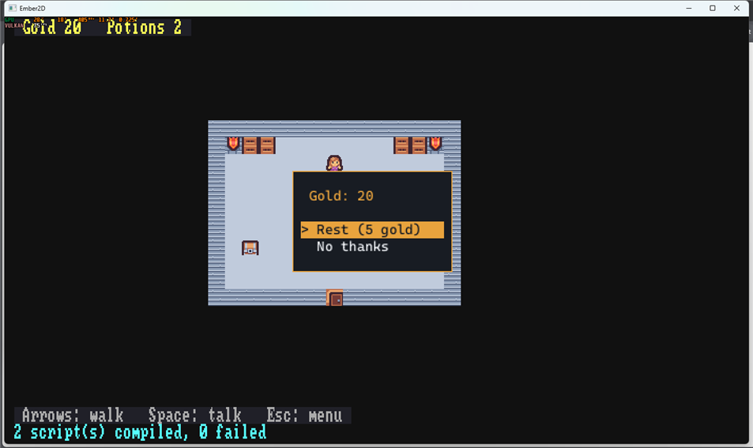

## 8. Tall grass and random battles

Make `field.level` (50x30) with a winding `dirt` path and a few patches of
tall grass. Tall grass is the `sprout` region:

1. Paint `grass` on Background under each patch.
2. Paint `sprout` over it on the **Foreground** layer, so it half-hides
   the hero.
3. Edit the `sprout` palette entry and give it the **Tag** `tallgrass`
   before painting.

The player script checks where it just stepped:

```rust
fn encounter_odds() { 7 }      // 1 in this many steps on tall grass

    // ...after set_position:
    if ctx.get_tile_tag(nx, ny) == "tallgrass" && ctx.random_int(1, encounter_odds()) == 1 {
        let foes = ["slime", "slime", "bat", "spider", "ghost"];
        ctx.push_scene("battle", #{ data: #{ enemy: ctx.random_choice(foes), boss: false } });
    }
```

`random_int` and `random_choice` use the level's seeded random numbers.
The same seed and the same key presses always give the same fights, which
is what lets `ember2d/tests/rpg_demo.rs` replay a battle exactly.

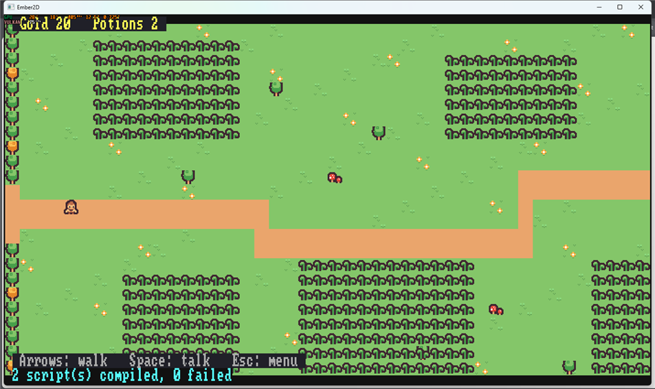

## 9. The battle scene

A **scene** is a script that runs on top of the level. While it's open,
the level underneath is paused. **File > New Scene**, name it `battle`.
That creates `scenes/battle.rhai` from a template you can open and close
right away (`ctx.push_scene("battle")`, then Escape).

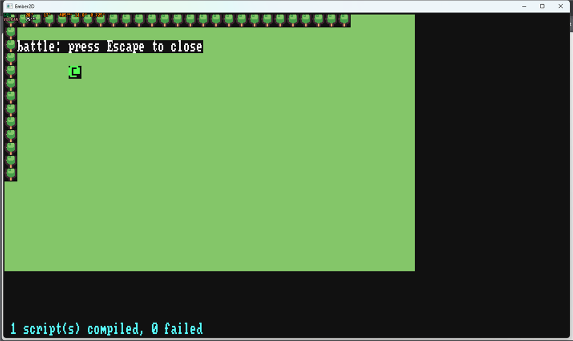

The demo's battle (`demos/rpg/scenes/battle.rhai`, about 230 lines) is
built from four pieces. Copy it, then read it with these in mind:

- **`on_start` builds the screen out of sprites.** It reads the enemy from
  `ctx.scene_data()`. Then it spawns, relative to the camera
  (`get_camera_x/y`, `get_viewport_width/height`):
  - a backdrop: `spawn_entity`, then `set_sprite(bg, "extras", "battle_bg")`
    and `set_size` to cover the view;
  - the enemy: `set_sprite(foe, "dungeon", e.region)`, sized up;
  - the two heroes: `play_project_clip(ash, "hero_walk")`, `set_size(ash, 2, 2)`,
    and `set_flip` to face the enemy;
  - a hidden effect sprite for the slash.

  A higher `set_layer_order` puts the battle above the map.
- **A state machine.** One var, `state`, says what's happening:

  ```
  intro -> choose -> result -> enemy -> choose ...
                            -> won / fled / lost
  ```

  Each state waits for its dialogue box or menu, using the same
  `said`/menu pattern as the townsfolk.
- **Menus per hero.** Lyra's has "Fire spell"; Ash's doesn't. Menus open
  with `cancelable: false`, so Escape can't skip a turn. An attack plays
  the slash once: `play_project_clip_once(fx, "slash")`.
- **`finish`** despawns the battle's sprites and calls `ctx.pop_scene()`.
  The map picks up where it left off, with the party's new HP and gold
  already in persistent state. Losing heals the party, halves the gold
  and calls `ctx.load_level("inn.level", "door")`, waking up at the inn.

The battle also blanks rows 0 and 23 of the HUD with `fill_rect`. The
map's own status line stays on screen underneath, frozen with the map; a
scene's HUD is drawn over it.

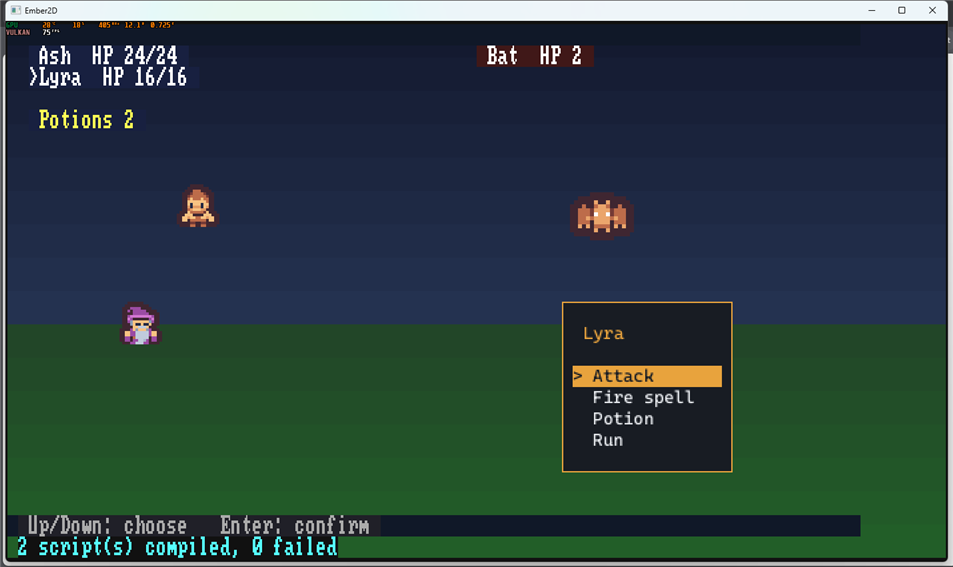

**The boss** is a `cyclops` tile at the end of the field's path (tag
`boss`, script `scripts/npc.rhai`). Talking to it roars, then pushes the
same battle with `#{ enemy: "cyclops", boss: true, boss_id: id }`.
Winning sets `boss_done` and despawns it. Its `on_start` despawns it again
whenever the field is entered after that:

```rust
fn on_start(id, ctx) {
    if ctx.get_tag(id) == "boss" && ctx.has_persistent("boss_done")
        && ctx.get_persistent("boss_done") == true {
        ctx.despawn(id);
    }
}
```

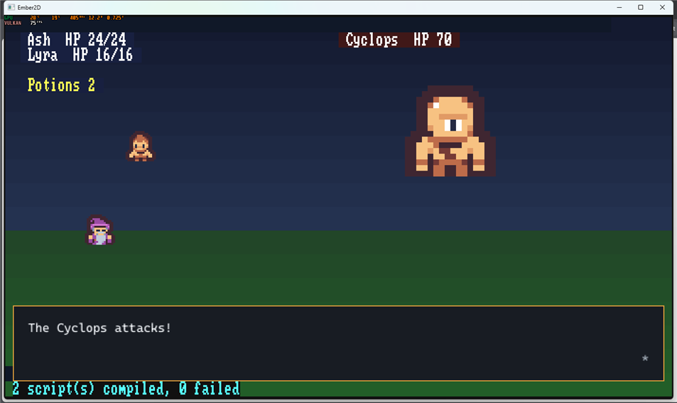

## 10. The pause menu and saving

Escape opens the engine's built-in pause menu. To replace it, add a scene
named `pause` (**File > New Scene**, `pause`). The demo's
`demos/rpg/scenes/pause.rhai` offers Party, Items (use a potion), Save,
Title screen and Close. Save is two lines:

```rust
        ctx.pop_scene();                 // close the menu first...
        ctx.save_game("emberfall.sav");  // ...so the save doesn't include it
```

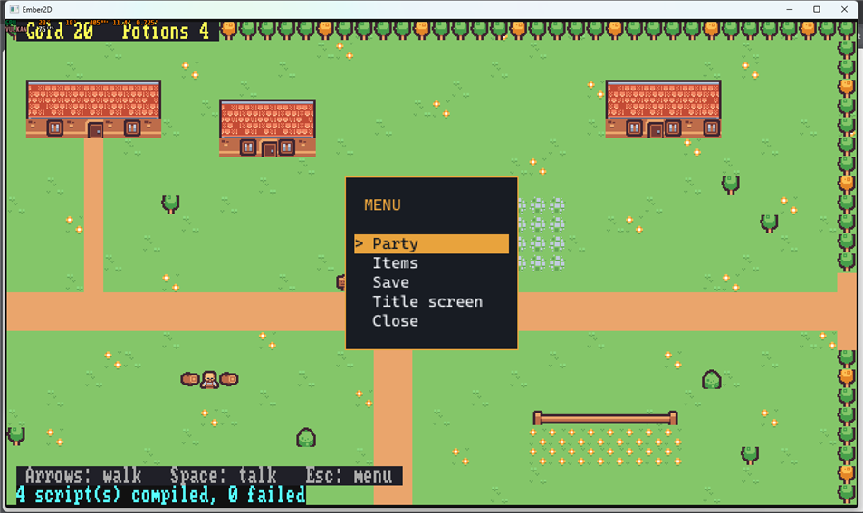

## 11. The title screen

Make `title.level`: a bit of scenery, with `scripts/title.rhai` on the
player. Its `on_start` hides the player (`set_visible(id, false)`) and
opens a menu: New Game, Continue, Quit.

- **New Game** sets up the persistent party (the same code as the player
  script) and calls `ctx.load_level("town.level")`.
- **Continue** calls `ctx.load_game("emberfall.sav")`.
- **Quit** calls `ctx.quit_game()`.

The whole file is `demos/rpg/scripts/title.rhai`.

Set **File > Project Settings... > Start level** to `title.level`. Your
game now starts at the title.

## 12. Ship it

**File > Export Game...** writes a folder holding the game, your levels,
`scripts/`, `scenes/` and `assets/`, ready to zip and share.

---

## Where to go next

- `docs/ember2d-scripting-api.md` lists every script function. The ones
  this tutorial leans on are in its "Scenes", "Menus and dialogue",
  "Camera" and "Sprites" sections.
- The finished project is `demos/rpg/`. `ember2d/tests/rpg_demo.rs` plays
  it from a test: the title menu, the elder's quest, a battle, the boss
  and a save/load round trip.
- The art is by Kenney (CC0). See `demos/rpg/assets/CREDITS.md`.
