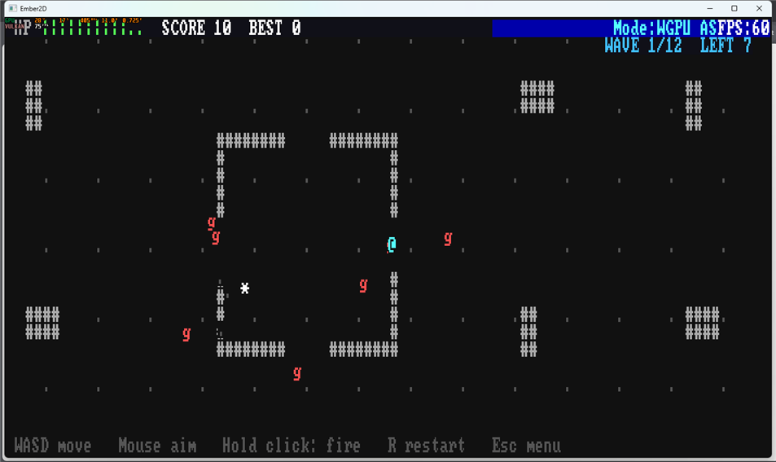
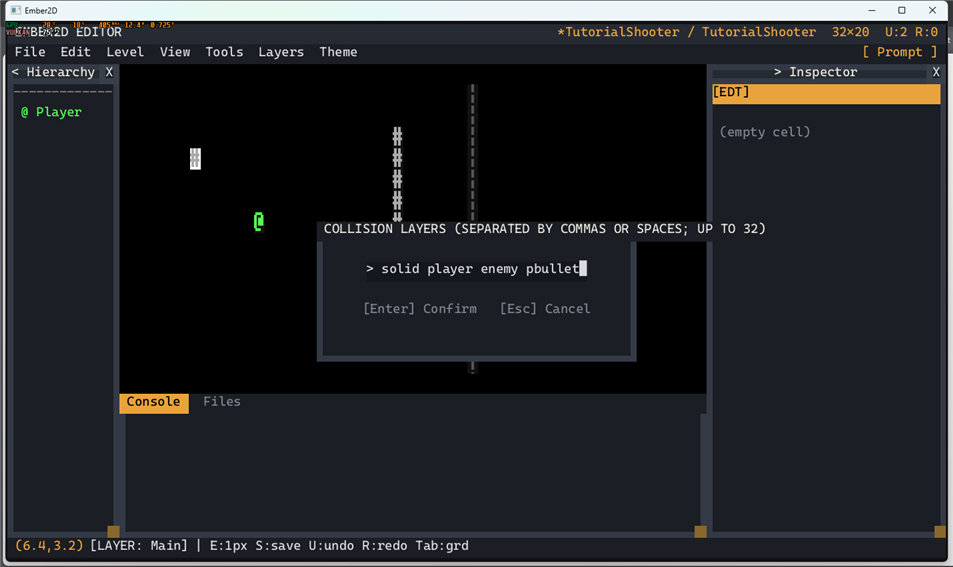
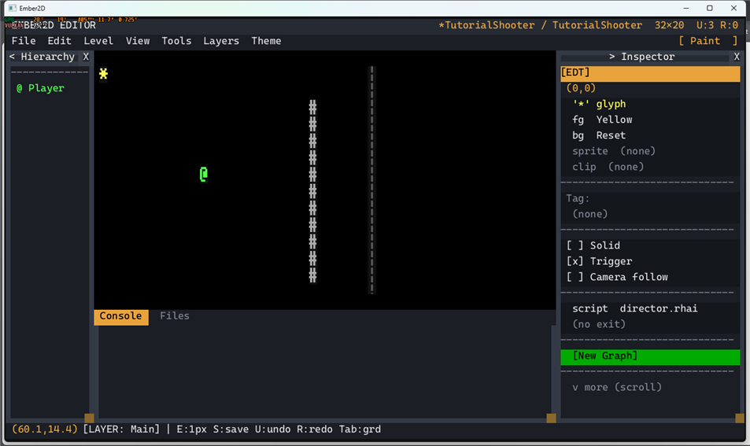
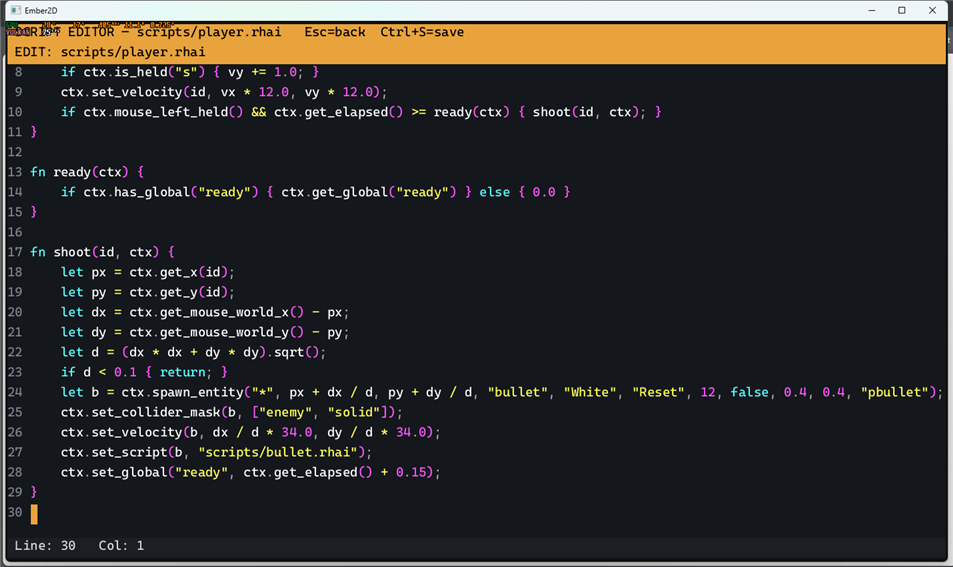
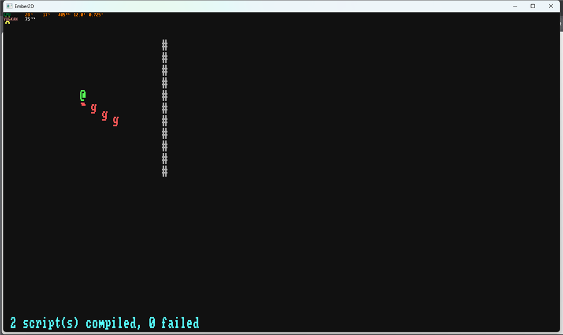
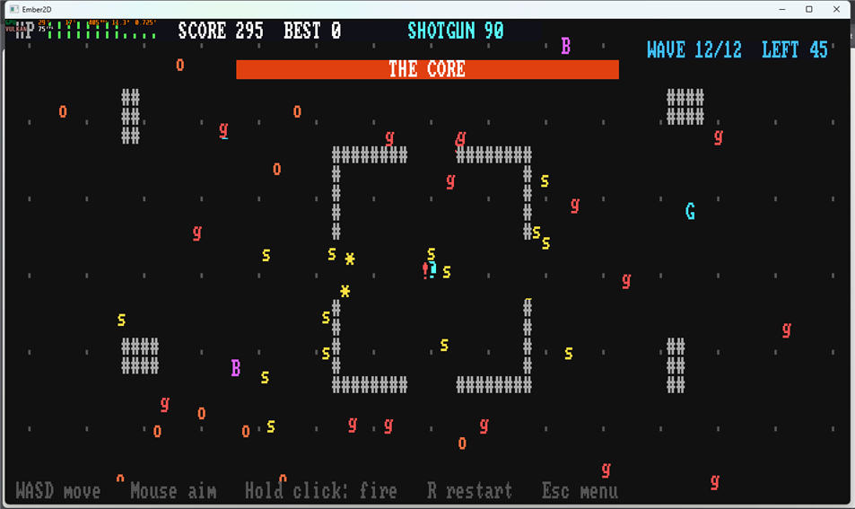
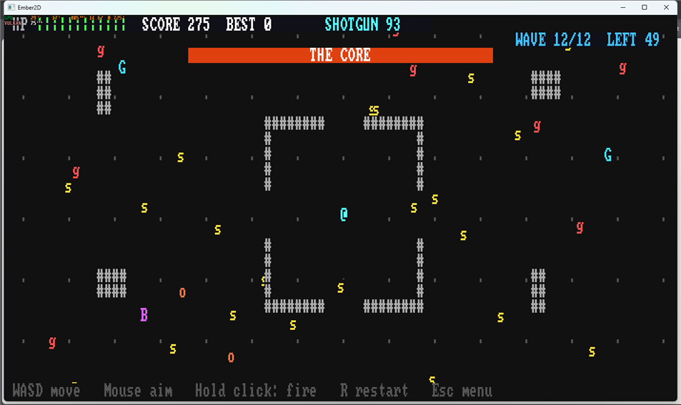
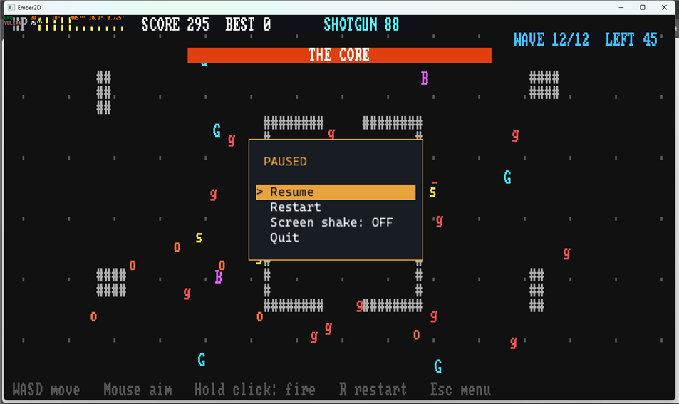
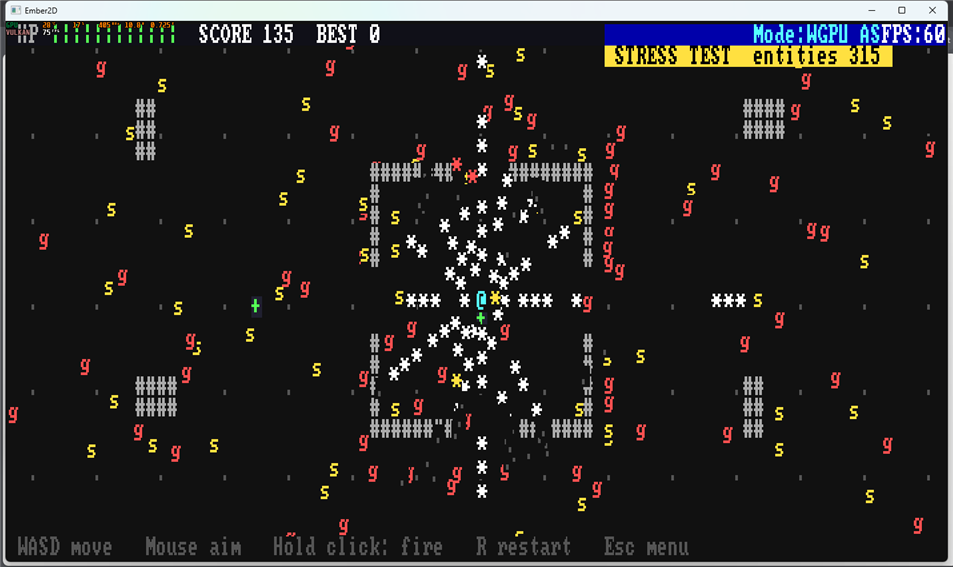

# Tutorial: Ember Assault, an arena shooter (and a stress test)

You'll build **Ember Assault**, a real-time top-down shooter. It has:

- a 160×60 arena the camera scrolls around;
- twelve waves of grunts, swarmers, brutes, and gunners that shoot back;
- spread, shotgun and rapid-fire powerups;
- a boss with an armoured ring;
- sound effects, screen shake you can switch off, and a best score kept
  on disk;
- a stress level that keeps over 300 entities alive, to measure the
  engine with.

The finished game ships in `demos/shooter/`:

```
cargo run -- demos/shooter/arena.level      # the game
cargo run -- demos/shooter/stress.level     # the stress test (press F3 for the frame rate)
```



The first stages (an arena, a player who moves and shoots, enemies that
chase) are typed in full. The rest shows the key code; the finished
scripts are commented throughout:

| File | What it does |
|---|---|
| `scripts/player.rhai` | moving, aiming, the four weapons, pickups, the HUD, the best score |
| `scripts/bullet.rhai` | a player bullet: only `on_collide` |
| `scripts/pellet.rhai` | a shotgun pellet: a bullet that burns out |
| `scripts/ebullet.rhai` | an enemy shot |
| `scripts/director.rhai` | waves, steering, gunners, the boss, contact damage, the stress test |
| `scenes/pause.rhai` | the Escape menu, with the shake option |

---

## 1. A real-time project and an arena

`cargo run`, **New Project**:

1. Name it.
2. **Real-Time**.
3. Confirm the location.
4. **Empty Canvas**.

Then build the arena:

- **Level > Resize Level**, type `160x60`. The demo's arena is 160×60;
  any size works, and the camera scrolls it.
- Paint the walls with the **Wall** palette entry (it's solid):
  - **Tools > Rect** for blocks;
  - **Tools > Line** (click the start, click the end) for long runs.

  Put a ring around the edge, and some cover inside.
- **Level > Set Spawn** (**P**), and click where the player starts.

## 2. Collision layers

Bullets will be cheap only if they test against the things they can hit
and nothing else, not each other. That's what collision **layers** and
**masks** are for:

- every collider is on one layer;
- its mask lists the layers it collides with.

The names a level knows are its **collision layers**. Open **Level >
Collision Layers...** and enter:

```
solid, player, enemy, pbullet
```

The demo also has `ebullet` (enemy shots) and `pickup`. A layer name that
isn't in this list doesn't filter anything.



Select the Player (Hierarchy) and set its collider **layer** to `player`
in the Inspector.

## 3. The director tile

Paint any non-solid tile in a corner. Choose **Tools > Select** (**Q**),
click it, and set its **script** to `scripts/director.rhai`. This tile's
script will run the whole game around the player.



## 4. Moving and shooting

**File > New Script**, `scripts/player.rhai`:

```rust
// scripts/player.rhai - WASD to move, hold the left button to fire.
fn on_input(id, ctx) {
    let vx = 0.0;
    let vy = 0.0;
    if ctx.is_held("a") { vx -= 1.0; }
    if ctx.is_held("d") { vx += 1.0; }
    if ctx.is_held("w") { vy -= 1.0; }
    if ctx.is_held("s") { vy += 1.0; }
    ctx.set_velocity(id, vx * 12.0, vy * 12.0);
    if ctx.mouse_left_held() && ctx.get_elapsed() >= ready(ctx) { shoot(id, ctx); }
}

fn ready(ctx) {
    if ctx.has_global("ready") { ctx.get_global("ready") } else { 0.0 }
}

fn shoot(id, ctx) {
    let px = ctx.get_x(id);
    let py = ctx.get_y(id);
    let dx = ctx.get_mouse_world_x() - px;
    let dy = ctx.get_mouse_world_y() - py;
    let d = (dx * dx + dy * dy).sqrt();
    if d < 0.1 { return; }
    let b = ctx.spawn_entity("*", px + dx / d, py + dy / d, "bullet", "White", "Reset", 12, false, 0.4, 0.4, "pbullet");
    ctx.set_collider_mask(b, ["enemy", "solid"]);
    ctx.set_velocity(b, dx / d * 34.0, dy / d * 34.0);
    ctx.set_script(b, "scripts/bullet.rhai");
    ctx.set_global("ready", ctx.get_elapsed() + 0.15);
}
```



How the bullet is built:

- The long form of `spawn_entity` takes glyph, position, tag, colours,
  draw order, solid, collider size and **layer**. The bullet goes on
  `pbullet`, and its mask is set to `enemy` and `solid`.
- Physics moves it (`set_velocity`).
- Its script, `bullet.rhai`, is attached with `set_script`.

Set the Player's **script** to `scripts/player.rhai`.

## 5. Bullets that only wake up on impact

**File > New Script**, `scripts/bullet.rhai`:

```rust
// scripts/bullet.rhai - a bullet only needs a script when it hits something.
fn on_collide(id, other, ctx) {
    if ctx.is_tilemap(other) { ctx.despawn(id); return; }
    if !ctx.has_var(other, "hp") { return; }
    ctx.despawn(id);
    if ctx.add_var(other, "hp", -1) == 0 {
        ctx.emit_particles(ctx.get_x(other), ctx.get_y(other), "*", "Red");
        ctx.despawn(other);
    }
}
```

There is no `on_update`. The engine only calls the lifecycle functions a
script defines, so a bullet costs nothing per frame until it hits
something: a wall (`is_tilemap`) or an enemy.

`add_var` subtracts and returns the new value. That's safe when two
bullets hit the same enemy in one frame: each sees its own result, so
only the hit that takes it to zero kills it.

## 6. Enemies that chase

**File > New Script**, `scripts/director.rhai`:

```rust
// scripts/director.rhai - spawn some grunts, then steer them at the player.
fn on_start(id, ctx) {
    for i in 0..5 {
        let e = ctx.spawn_entity("g", 18.0 + i * 2.0, 11.0, "grunt", "Red", "Reset", 8, false, 1.0, 1.0, "enemy");
        ctx.set_var(e, "hp", 2);
    }
}

fn on_update(id, ctx) {
    let p = ctx.find_by_tag("player");
    for e in ctx.find_all_by_tag("grunt") {
        let dx = ctx.get_x(p) - ctx.get_x(e);
        let dy = ctx.get_y(p) - ctx.get_y(e);
        let d = (dx * dx + dy * dy).sqrt();
        if d > 0.5 { ctx.set_velocity(e, dx / d * 3.0, dy / d * 3.0); }
    }
}
```

Save, **F5**, and shoot the grunts down.



Enemies have **no script of their own**. The director loops over them
every frame. One script steering a hundred enemies is much cheaper than
a hundred scripts. Bullets are the opposite: each hit is that bullet's
own news.

## 7. Waves

The real director runs twelve waves. `wave_plan(w)` lists each wave's
grunts, swarmers, brutes and gunners. A wave goes through these phases:

- A **breather** (three seconds) shows a banner.
- `next_wave` fills a **queue** with the wave's enemies and shuffles it.
- Three enemies arrive per frame, at random open spots 25–60 cells from
  the player (`spawn_spot`).
- The wave ends when the queue is empty and nobody's left.

A step's script reads the world as it was when the step began. So a kill
this frame still counts as "left" until the next frame. That's harmless:
the wave just ends a frame later.

## 8. Gunners, enemy shots and contact damage

- **Gunners** keep 8–13 cells away. They back off when you're close and
  circle when in range. Every second and a half they fire an enemy shot
  (`fire`), with its own script `ebullet.rhai`; its mask is `player` and
  `solid`.
- **Damage to the player** uses `add_global("hp", -1)`, not
  `set_global(get_global(...) - 1)`. Writes are deferred, so two hits in
  one frame would otherwise count once.
- **Invulnerability.** After a hit, the player is safe for a moment
  (`hurt_until`). Contact damage (`contact_damage`, the largest of
  whatever touches you) shares it.

## 9. Weapons without trigonometry

A spread shot turns the aim direction by a few degrees. `sin` and `cos`
come from the platform's maths library, which can differ by a bit
between machines, and the simulation must be identical everywhere. So the
three angles used are written down once:

```rust
fn turn(d, c, s) { [d[0] * c - d[1] * s, d[0] * s + d[1] * c] }
fn turn12(d, sign) { turn(d, 0.9781476, 0.2079117 * sign) }   // cos 12°, sin 12°
```

The four weapons:

- **Spread** fires three bullets.
- **Shotgun** fires seven pellets. `pellet.rhai` gives them a short life.
- **Rapid** halves the cooldown.
- **Pistol** is what you start with.

Powerups drop from gunners. Brutes drop medkits. The player's
`on_collide` picks them up.



## 10. The boss

Wave 12 adds **the Core**: an `O` with eight armour pieces. Each piece is
its own entity, made a child of the core with `set_parent`, so it moves
with it. A bullet that hits a piece passes the damage to the core:

```rust
let target = if ctx.has_tag(other, "boss_part") { ctx.get_parent(other) } else { other };
```

The Core fires rings of sixteen shots; the directions are written down,
like the spread's. When hurt, it fires faster and calls swarmers. A bar
across the top shows its health.



## 11. Sound, camera, HUD

- **Sound effects** are Kenney's CC0 Sci-Fi Sounds, in `audio/` with a
  credits file. `ctx.play_sound("audio/explode.ogg")`.
- **The camera** follows the player (tick **Camera follow** in the
  Inspector). It stays inside the arena with
  `set_camera_bounds(0, 0, 160, 60)`.
- **The HUD** is drawn on the screen grid:
  - the HP bar, score, best and weapon timer on row 0, only as wide as
    they need, so F3's frame-rate bar can show at the right;
  - the wave and the enemies left on row 1.

## 12. The pause menu, options and the best score

`scenes/pause.rhai` replaces the engine's pause menu: Resume, Restart,
**Screen shake: ON/OFF**, Quit.

Two things must outlive a run, and `save_game` (a whole game) is the
wrong tool for them:

- the shake option;
- the best score.

`save_data` and `load_data` keep one value in its own small file:

```rust
ctx.save_data("ember_assault_best.sav", score);              // when a run ends with a new best
let best = ctx.load_data("ember_assault_best.sav");          // () if there's none yet
```

Paths work as `save_game`'s do: relative to the working directory.



## 13. The stress test

`stress.level` is the same arena with the director tile's **tag** set to
`stress`. The director checks its own tag (`get_tag(id)`) and, instead of
waves:

- keeps about 240 enemies alive (wandering, so they don't just mob you);
- pours a ring of bullets out of the player, six a frame.

That's 300 to 400 live entities, every one moving, colliding and being
scripted.



Measured when this tutorial was written:

| | |
|---|---|
| Live, debug build (F3) | **60 FPS** with 315 entities |
| `cargo run --release -p ember2d-sim --example bench_sim` | 2.6 ms per step for ~293 entities (simulation only: step, physics, collisions) |
| `cargo test -p ember2d --test shooter_siege` (debug, headless) | about 3.4 ms per step with 310 entities |

Most of that time is the director's Rhai loop over every enemy. The
engine's own share is the per-step world snapshot (0.29 ms) and collision
detection (0.05 ms).

---

## Where to go next

- `docs/ember2d-scripting-api.md`: "Colliders" (layers and masks),
  "Entity lifecycle" (`spawn_entity`'s long form, `set_script`), "Save
  data" (`save_data`/`load_data`), "Hierarchy" (`set_parent`).
- `ember2d/tests/shooter_siege.rs` plays the waves, weapons, gunners and
  boss headlessly, checks that a death saves the best score, and runs the
  stress level.
